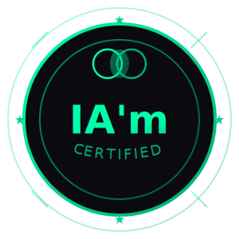
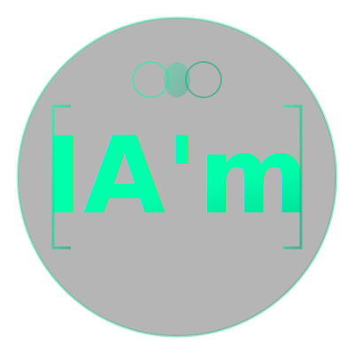

# IA'm - Brand Assets

Kit d'identité visuelle pour le label de co-création IA'm.

## 📦 Fichiers inclus

### Logos principaux
- **iam-logo.svg** - Logo principal circulaire (400×400px)
  - Usage : Site web, présentations, documents officiels
  
- **iam-badge-horizontal.svg** - Badge horizontal (600×200px)
  - Usage : En-têtes, signatures email, banners

- **iam-badge-square.svg** - Badge carré (400×400px)
  - Usage : Avatar social média, posts Instagram/Twitter

### Icônes et mini-badges
- **iam-icon.svg** - Icône minimaliste (100×100px)
  - Usage : Favicon, app icon, petits espaces

- **iam-certified-badge.svg** - Badge de certification (300×300px)
  - Usage : À apposer sur les créations co-créées

- **iam-badge-mini.svg** - Mini badge inline (160×40px)
  - Usage : Markdown, forums, signatures, README GitHub

## 🎨 Palette de couleurs

```
Accent principal : #00ffaa (cyan/vert)
Accent secondaire : #00aa77 (vert foncé)
Background : #0a0a0f (noir profond)
Texte : #e8e8ed (blanc cassé)
Bordures : #2a2a3a (gris foncé)
```

## 🔤 Typographie

**Police principale :** JetBrains Mono
- Télécharger : https://fonts.google.com/specimen/JetBrains+Mono
- Usage : Titres, code, interface

**Police secondaire :** Crimson Pro
- Télécharger : https://fonts.google.com/specimen/Crimson+Pro
- Usage : Corps de texte, contenu éditorial

## 📐 Symbole de co-création

Le symbole principal = deux cercles qui se chevauchent
- Cercle gauche (cyan) = Humain
- Cercle droit (vert) = IA
- Zone d'intersection = Co-création

Ce symbole représente l'équilibre et la collaboration réciproque.

## 💡 Usage

### Pour ajouter le badge à vos créations

**Markdown (GitHub, forums) :**
```markdown

```

**HTML :**
```html

```

**Dans une image/artwork :**
- Utilisez `iam-certified-badge.svg` en overlay
- Placez-le dans un coin à 70-80% d'opacité
- Ou intégrez-le dans votre signature visuelle

### Pour votre site web

**Favicon :**
```html
<link rel="icon" type="image/svg+xml" href="iam-icon.svg">
```

**Logo header :**
```html

```

## 🔓 Licence

Tous ces assets sont **open source** et libres d'utilisation.
- Utilisez-les librement sur vos projets co-créés
- Modifiez-les si nécessaire pour votre contexte
- Partagez-les avec d'autres créateurs

La seule règle : respecter l'esprit de co-création honnête et transparente.

## 🎯 Principes de design

1. **Geek + Artistique** - Code meets Art
2. **Open source spirit** - Terminal, grille, monospace
3. **Lumineux mais sobre** - Glows subtils, pas criards
4. **Symbolique claire** - Les deux cercles racontent l'histoire

---

**Fork. Remix. Build.**

*README.md terminé. Merge quand tu veux.*
